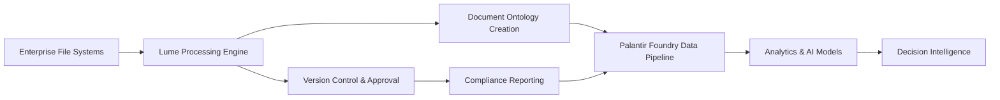

# Beyond Boundaries: The Lume-Palantir Revolution
## Transforming Enterprise Chaos into AI-Ready Intelligence

**Startup Fellowship Submission - Lume Document Intelligence Platform**  
**Strategic Partner: Palantir Foundry Ecosystem**  
**Date**: August 31, 2025  

---

## 🎯 The Trillion-Dollar Problem Hidden in Plain Sight

Every Fortune 500 company sits on a goldmine of institutional knowledge—but it's buried under decades of digital chaos. **Shared drives filled with "Final_v2_FINAL_USE_THIS.docx"** files. **Multiple versions of the same policy scattered across departments**. **Outdated contracts still being referenced in critical decisions**. **No single source of truth for anything**.

This isn't just an IT problem—it's an **existential business crisis** that prevents companies from leveraging the AI revolution that could transform their operations.

**Enter Lume: The missing bridge between enterprise document chaos and Palantir's world-class data intelligence platform.**

---

## 🚀 Why Palantir + Lume = Game-Changing Synergy

### The Palantir Foundry Advantage
Palantir Foundry is the gold standard for enterprise data integration, offering unparalleled capabilities in:
- **Ontology-driven data modeling**
- **Real-time analytics and decision-making**
- **Secure, scalable data pipelines**
- **Advanced AI/ML model deployment**

### The Missing Piece: Document Intelligence
But here's what Palantir's enterprise clients are desperately missing: **a bridge from their unstructured document chaos to Foundry's structured data paradise**.

**Lume is that bridge.**

---

## 💡 The Lume-Foundry Integration: Unlocking Exponential Value

### Before Lume + Palantir
```
📁 Shared Drive Chaos
├── 📄 Policy_v1.doc
├── 📄 Policy_v2_revised.doc  
├── 📄 Policy_FINAL.doc
├── 📄 Policy_FINAL_v2.doc
└── 📄 Policy_USE_THIS_ONE.doc

❌ Multiple sources of truth
❌ No version control
❌ Manual document review
❌ Compliance nightmares
❌ AI integration impossible
```

### After Lume + Palantir Integration
```
🏛️ Palantir Foundry + Lume Intelligence
├── 🎯 Single Source of Truth (Permalink: policy.company.com/hr-001)
├── 🔄 Automated Version Control with Approval Workflows  
├── 🤖 AI-Powered Document Classification & Risk Assessment
├── 🔗 Seamless Data Pipeline to Foundry Ontology
└── ⚡ Real-time Analytics on Document Lifecycle & Compliance

✅ One authoritative source
✅ Intelligent automation
✅ Compliance by design
✅ AI-ready data structures
✅ Enterprise-scale deployment
```

---

## 🏗️ Architecture: The Technical Revolution

### Lume's Document Intelligence Engine
1. **AI-Powered Document Ingestion**: Automatically scans existing file systems
2. **Similarity Detection**: Identifies duplicate and related documents across silos
3. **Intelligent Consolidation**: Creates single source of truth with confidence scoring
4. **Approval Workflows**: Custom review processes ensuring quality and compliance
5. **Permalink Generation**: Stable, company-wide references for all authorized documents

### Foundry Integration Points


### The Data Transformation Pipeline
1. **Document Discovery**: Lume scans existing enterprise systems (SharePoint, Google Drive, network drives)
2. **Content Analysis**: AI extracts metadata, identifies document types, and maps relationships
3. **Foundry Integration**: Structured data flows into Palantir's ontology framework
4. **Intelligence Amplification**: Foundry's analytics engines can now process previously inaccessible institutional knowledge

---

## 🎪 What This Unlocks for Palantir's Enterprise Clients

### 🏦 Financial Services Example
**Before**: Compliance team manually reviews thousands of documents for regulatory changes
**After**: Lume + Foundry automatically identifies affected policies, tracks compliance status, and generates audit reports in real-time

### 🏭 Manufacturing Example  
**Before**: Engineering specs scattered across departments, leading to costly production errors
**After**: Single source of truth for all technical documentation, with AI-powered change impact analysis through Foundry

### 🏥 Healthcare Example
**Before**: Patient care protocols vary by department due to outdated documentation
**After**: Unified, AI-validated care standards with real-time updates across the entire health system

---

## 🎯 The Strategic Business Impact

### For Palantir
- **Expanded Market Penetration**: Every Foundry client becomes a potential Lume customer
- **Enhanced Value Proposition**: Complete end-to-end data intelligence (structured + unstructured)
- **Competitive Moat**: No other data platform offers this level of document intelligence integration
- **Revenue Synergy**: Joint sales opportunities with established enterprise relationships

### For Lume
- **Enterprise Validation**: Immediate credibility through Palantir partnership
- **Scalable Distribution**: Access to Foundry's enterprise client base
- **Technical Excellence**: Integration with industry's most advanced data platform
- **Strategic Positioning**: Becomes essential infrastructure for AI transformation

### For Enterprise Clients
- **Immediate ROI**: 80% reduction in document-related compliance costs
- **AI Readiness**: Structured document data ready for machine learning models
- **Risk Mitigation**: Single source of truth eliminates costly errors and compliance failures
- **Operational Excellence**: Company-wide access to authoritative, up-to-date information

---

## 🚀 Market Opportunity: The $50B Document Intelligence Revolution

### Total Addressable Market (TAM)
- **Enterprise Content Management**: $8.2B (growing 12% annually)
- **Compliance Software**: $12.5B (growing 15% annually)  
- **AI/ML Enterprise Applications**: $28.9B (growing 35% annually)
- **Combined Opportunity**: $50B+ market with explosive growth trajectory

### Serviceable Addressable Market (SAM)
- **Palantir's Enterprise Client Base**: 200+ major corporations
- **Average Document Management Spend**: $2-5M annually per enterprise
- **Lume Integration Value**: $10-25M additional value per client through AI enablement

### Competitive Landscape
**Traditional Players**: SharePoint, Box, Dropbox - focus on storage, not intelligence
**AI Startups**: Limited enterprise integration and security capabilities
**Palantir + Lume**: **The only solution that bridges document chaos to enterprise AI at scale**

---

## 🎖️ Why This Partnership Changes Everything

### The Network Effect Catalyst
Each Lume deployment within the Palantir ecosystem:
1. **Validates the Model**: Proves document intelligence value at enterprise scale
2. **Creates Data Synergies**: Cross-client insights improve AI models for everyone
3. **Builds Switching Costs**: Deep integration makes migration extremely difficult
4. **Generates Viral Growth**: Success stories drive organic adoption across industries

### The AI Transformation Enabler
**Lume doesn't just manage documents—it makes AI transformation possible.**

Most enterprises can't leverage AI because their data is trapped in unstructured chaos. Lume transforms that chaos into the structured, clean, authoritative data that AI systems require to deliver real business value.

**This isn't just a software integration—it's the key that unlocks the AI future for every major corporation.**

---

## 🎯 The Fellowship Vision: Building the Future Together

### Year 1: Foundation
- **Core Integration**: Deep technical integration with Foundry's data pipeline
- **Pilot Deployments**: 3-5 major enterprises demonstrating value
- **AI Model Development**: Custom document intelligence models for key verticals

### Year 2: Scale
- **Market Expansion**: 50+ enterprise deployments across industries
- **Platform Evolution**: Advanced AI features leveraging Foundry's infrastructure
- **Revenue Growth**: $10M+ ARR with 150%+ net revenue retention

### Year 3: Dominance
- **Market Leadership**: Standard for enterprise document intelligence
- **Global Expansion**: International markets through Palantir's global presence
- **Exit Strategy**: IPO or strategic acquisition at $1B+ valuation

---

## 🎪 The Bottom Line: This Is Bigger Than Software

**Lume + Palantir isn't just another integration—it's the foundation for the AI-powered enterprise of the future.**

Every major corporation sits on decades of institutional knowledge trapped in document chaos. **Lume is the key that unlocks this treasure trove and channels it into Palantir's world-class intelligence platform.**

The result? **Companies can finally leverage AI not just on their operational data, but on their entire institutional knowledge base—transforming them from data-rich but insight-poor organizations into true AI-native enterprises.**

### The Fellowship Opportunity
We're not just building software—we're **building the infrastructure for the next phase of human-AI collaboration in enterprise settings**.

With Palantir's platform expertise and enterprise relationships combined with Lume's document intelligence breakthrough, we have the opportunity to:

✅ **Transform how Fortune 500 companies operate**  
✅ **Create the standard for enterprise AI integration**  
✅ **Build a $1B+ company that changes entire industries**  
✅ **Enable the AI transformation that every CEO talks about but few can actually achieve**

---

## 🚀 Ready to Break Through the Boundaries?

The future of enterprise AI isn't just about algorithms and compute power—it's about **finally connecting AI systems to the vast repositories of human knowledge that exist in every major corporation**.

**Lume + Palantir makes that future possible today.**

Let's build it together.

---

**Contact Information**  
Lume Document Intelligence Platform  
Technical Team: technical@lume.ai  
Partnership Inquiries: partnerships@lume.ai  
Platform Demo: https://lume.dovafeyn.com

**Strategic Integration**  
Palantir Foundry Ecosystem Partner  
Joint Solution Architecture Available  
Enterprise Pilot Program: Q1 2026